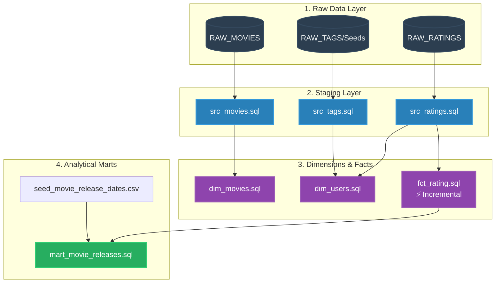

# Netflix Analysis: Modern Data Stack (dbt & Snowflake)

An end-to-end Modern Data Stack (MDS) implementation featuring an ELT data transformation pipeline. This repository defines a **dbt (data build tool)** project configured to work with a **Snowflake** cloud data warehouse, transforming raw Netflix/MovieLens dataset tables into a structured dimensional schema and an analytical data mart.

---

## 🏗️ Architecture & Data Flow

The project leverages a medallion-style multi-layered modeling structure to systematically clean, transform, and model data.



---

## 🗂️ Data Modeling & Directory Structure

The dbt project is organized into structured modules representing different modeling layers:

### 1. Sources & Staging (`models/staging/`)
Staging models perform initial cleansing, casting, and renaming of source fields directly from the Snowflake `raw` schema.
*   **`src_movies.sql`**: Projects movie records (`movieId` mapped to `movie_id`, `title`, and pipe-delimited raw `genres`).
*   **`src_ratings.sql`**: Renames rating entities and converts raw epochs or string timestamps into Snowflake timestamp format (`TO_TIMESTAMP_LTZ`).

### 2. Dimension Tables (`models/dim/`)
Dimensions describe business entities.
*   **`dim_movies.sql`**: Standardizes movie titles (applying `INITCAP` and `TRIM`) and splits the pipe-delimited `genres` string into structured arrays (`SPLIT(genres, '|')`) for native query performance.
*   **`dim_users.sql`**: Consolidates and deduplicates a master set of users compiled from user interactions across rating and tagging tables.

### 3. Fact Tables (`models/fct/`)
Fact tables contain quantitative/transactional measurements.
*   **`fct_rating.sql`**: Materialized **incrementally** (`materialized='incremental'`) to optimize processing costs, tracking historical reviews/ratings left by users on movies.

### 4. Marts & Analytics (`models/mart/`)
The reporting layer built for business intelligence consumption.
*   **`mart_movie_releases.sql`**: Combines user rating histories with movie release dates (imported via seed files) to classify ratings relative to release milestones or evaluate user engagement trends over time.

---

## 🛠️ Snowflake Integration & Setup

To replicate this environment in your own Snowflake warehouse, follow this setup guide:

### 1. Database Setup
Execute the following statements in your Snowflake worksheet to initialize databases, schemas, and schemas for dbt target runs:

```sql
-- Create the main project database
CREATE DATABASE IF NOT EXISTS NETFLIX;

-- Create schemas for raw data ingestion and dbt outputs
CREATE SCHEMA IF NOT EXISTS NETFLIX.RAW;
CREATE SCHEMA IF NOT EXISTS NETFLIX.DEV;
```

### 2. Load Raw Source Tables
Load your dataset files (such as MovieLens movie metadata and ratings CSVs) into the `NETFLIX.RAW` schema as `RAW_MOVIES` and `RAW_RATINGS`.

---

## 🚀 Setting Up the dbt Project

Ensure you have dbt installed locally or run it via a virtual environment.

### 1. dbt Profile configuration (`profiles.yml`)
Set up your connection profile in `~/.dbt/profiles.yml`:

```yaml
netflix:
  target: dev
  outputs:
    dev:
      type: snowflake
      account: <your_snowflake_account_identifier>
      user: <your_username>
      password: <your_password>
      role: <your_role> # e.g. ACCOUNTADMIN or SYSADMIN
      warehouse: <your_warehouse> # e.g. COMPUTE_WH
      database: NETFLIX
      schema: DEV
      threads: 4
```

### 2. Run dbt Commands
Navigate to the `netflix/` project directory and execute the following commands:

```bash
# Verify connection to Snowflake
dbt debug

# Install dependencies if any are declared
dbt deps

# Load seed data (e.g. seed_movie_release_dates.csv)
dbt seed

# Run the transformation pipeline
dbt run

# Perform schema-level assertions and data validation tests
dbt test
```

---

## 📐 Data Integrity & Tests
Data validation rules are declared in `models/schema.yml`. Key assertions include:
*   **`not_null`** checks on entity keys (e.g., `movie_id`, `movie_title`).
*   **`unique`** constraints mapping relationships between business keys and dimensions.
